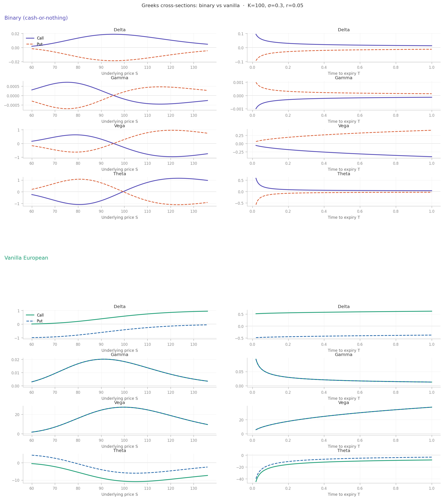

# PolyGreeks

**TradFi-style risk analytics for Polymarket prediction markets.**

PolyGreeks prices Polymarket crypto contracts as cash-or-nothing binary European options, sources implied volatility from live Deribit options markets, and computes the full set of Greeks for any position. The spread between Polymarket's crowd-implied probability and the model-implied probability is a measurable mispricing that can be exploited with dynamic hedging, and the Greeks tell you exactly how to construct those hedges.

---

## Who this is for

PolyGreeks is built for quantitatively sophisticated traders who are already fluent in derivatives but want structured risk intuition applied to prediction markets.

**Target audience:**
- Options traders and vol desks who trade on Deribit and want to extend their edge into Polymarket
- Quant researchers studying cross-venue mispricings between crowd probabilities and model probabilities
- Market makers on Polymarket who need Greeks to reason about hedging and inventory risk
- Crypto traders with a TradFi background who are comfortable with Black-Scholes but new to prediction markets

**What you need to use this effectively:**
- Understanding of options Greeks (delta, gamma, vega, theta)
- Understanding of the Black-Scholes model and options pricing
- A Deribit account for executing hedges. Deribit is a professional derivatives exchange built for advanced traders, with deep BTC/ETH options books and low-latency execution
- A Polymarket account for the prediction market leg of any trade

---

## Intended use cases

### 1. Spotting mispricings before they close
The dashboard ranks live Polymarket crypto contracts by $|p_{PM} - p_{BS}|$. Contracts near the top represent the largest divergences between crowd sentiment and what the options market implies. A trader can evaluate whether the gap is tradeable or explained by model limitations before it closes.

### 2. Hedging a Polymarket position with Deribit options
If you hold YES shares on a BTC contract, you have unhedged directional exposure to BTC's price. The hedge calculator identifies the specific Deribit instrument (e.g. BTC put, strike $61k, expiring Jun 27), tells you exactly how many contracts to buy or sell, and shows what your combined portfolio Greeks look like after the hedge is in place.

### 3. Harvesting theta on deep ITM contracts
Binary options have a unique property that regular options don't: deep in-the-money positions accrue positive theta. A trader holding a high-probability YES position is being paid by time decay rather than paying it. The theta harvest analyzer quantifies this daily income and shows the cost of an OTM put on Deribit to cap tail risk.

### 4. Scenario analysis before entering
The What-If simulator lets you drag BTC spot price and implied vol sliders to see how model probability, delta, gamma, theta, and vega respond before you put on a trade. This is useful for stress-testing a position against a vol spike or a sudden price move.

### 5. Building intuition about binary options Greeks
Binary Greeks behave very differently from vanilla in counterintuitive ways. Delta is bell-shaped rather than monotone, vega flips sign at ATM, and gamma can go negative. This tool surfaces those differences visually so traders can develop correct intuition before sizing positions. Even an institutionally endowed, sophisticated equities options trader will not immediately have intuition of these contracts due to this behavior. 

---

## The core insight

A Polymarket contract like *"BTC > $80k by June 27"* is structurally identical to a cash-or-nothing binary call option: it pays $1 if the condition is met, $0 otherwise. This means a binary variant of Black-Scholes can be applied to solve this problem.

- The market price implies a probability: $p_{PM} = \text{live Polymarket price}$
- Deribit's implied vol surface combined with options theory implies a separate model probability: $p_{BS} = \mathcal{N}(d_2)$
- The spread $|p_{PM} - p_{BS}|$ is a measurable mispricing that can be exploited with hedging

Binary option pricing formula:

$$V = e^{-rT} \mathcal{N}(\phi \, d_2)$$

$$d_2 = \frac{\ln(S/K) + (r - \frac{1}{2}\sigma^2)T}{\sigma\sqrt{T}}$$

where $\phi = +1$ for a call (YES share) and $\phi = -1$ for a put (NO share).

---

## Greeks

PolyGreeks computes four risk sensitivities for any position, so that traders can develop intuition as to how these work, as they are qualitatively distinct from equities greeks.  

| Greek | Binary formula | Key difference from vanilla |
|---|---|---|
| Delta | $\frac{\phi \, e^{-rT} n(d_2)}{S \sigma \sqrt{T}}$ | Bell-shaped (peaks ATM), not monotone |
| Gamma | $-\frac{\phi \, e^{-rT} n(d_2) \, d_1}{S^2 \sigma^2 T}$ | Changes sign at ATM |
| Vega | $-\frac{\phi \, e^{-rT} d_1 \, n(d_2)}{\sigma}$ | Negative for ITM — rising vol hurts you |
| Theta | $e^{-rT}\!\left(\phi \, n(d_2)\frac{d_2}{2T\sigma\sqrt{T}} + r\,\mathcal{N}(\phi d_2)\right)$ | Can be positive for deep ITM positions |

### Greeks cross-sections

Cross-sections of each Greek vs underlying price $S$ and time to expiry $T$, for both binary and vanilla calls/puts. Parameters: $K=100$, $\sigma=0.3$, $r=0.05$, $T=0.5$ fixed for $S$-cross-sections, $S=100$ fixed for $T$-cross-sections.

**Key things to note:**

- **Delta**: Binary call delta is bell-shaped and peaks ATM, then collapses, while vanilla delta is a monotone S-curve. As $T \to 0$ ATM, binary delta diverges, making near-expiry contracts extremely difficult to hedge.
- **Gamma**: Binary gamma changes sign at the strike. OTM binary is long gamma (like vanilla), ITM binary is short gamma (unlike vanilla, which is always positive).
- **Vega**: Binary vega changes sign at ATM. If you hold a deep ITM YES share (say 85% probability), you have *negative* vega — rising BTC volatility hurts your position by increasing the chance of falling back OTM. Vanilla vega is always positive.
- **Theta**: Deep ITM binary positions have *positive* theta, meaning time passing is good when you're nearly certain to be paid out. This makes theta harvesting mathematically possible in a way that it isn't with vanilla options.

---

## Alpha opportunities

Three distinct strategies emerge from the Greeks framework:

### 1. Probability mispricing
When $|p_{PM} - p_{BS}|$ exceeds transaction cost thresholds (~3–5%), the spread can be captured by:
- Taking the opposing side on Polymarket
- Hedging directional BTC exposure via Deribit options
- Net position: long the probability spread, delta-neutral

### 2. Vega arbitrage
ITM binary contracts have negative vega. If Deribit implied vol is elevated relative to your forecast:
- Buy YES on Polymarket (cheap relative to model)
- Short vega on Deribit to hedge
- Net position: probability-long, vega-neutral

### 3. Theta harvesting
Deep ITM contracts (e.g. 85% probability) have positive theta. Structure:
- Hold YES on Polymarket (collect daily theta)
- Buy OTM puts on Deribit to cap tail risk
- Net position: long theta, bounded downside

The combined Greek P&L equation for a delta-neutral book:

$$d\Pi = \frac{1}{2}\Gamma_{\text{net}}(dS)^2 - \Theta_{\text{net}}\,dt$$

---

## Data sources

| Source | Data | Endpoint |
|---|---|---|
| Polymarket Gamma API | Live market probabilities | `gamma-api.polymarket.com/markets` |
| Polymarket CLOB | Order book depth | `clob.polymarket.com` |
| Deribit REST | Implied vol surface + Greeks | `deribit.com/api/v2/public/get_order_book` |

Deribit is a professional derivatives exchange designed for advanced traders, with deep BTC and ETH options books and low-latency execution. Its public API provides real-time implied vol across strikes and expiries at no cost.

Vol is interpolated across expiries using variance-linear interpolation to match Polymarket's exact resolution date:

$$\sigma_{\text{interp}} = \sqrt{\frac{T_2 - T}{T_2 - T_1}\sigma_1^2 + \frac{T - T_1}{T_2 - T_1}\sigma_2^2}$$

---

## Features

- **Market scanner** — ranks live Polymarket crypto contracts by $|p_{PM} - p_{BS}|$, largest mispricings first
- **Greeks dashboard** — real-time Delta, Gamma, Vega, Theta for any position size
- **Payoff surface** — 2D P&L surface across probability × time to resolution
- **Hedge calculator** — step-by-step trade instructions: how many YES/NO shares to buy on Polymarket, and which specific Deribit contract to buy or sell and in what quantity, with combined portfolio Greeks after both legs
- **What-If simulator** — drag spot price and implied vol sliders to stress-test model probability and all Greeks before entering a position
- **Theta harvest analyzer** — computes daily theta income and OTM put hedge cost for deep ITM positions

---

## Model assumptions

This model is not perfect, and assumptions are stated explicitly so users can reason about model-level risk.

- Underlying follows Geometric Brownian Motion (fat tails not captured)
- Continuous hedging assumed; transaction costs not modeled
- Oracle/resolution risk not priced (no analog in exchange-traded options)
- Risk-free rate approximated at 5% annualized
- Arbitrage between Polymarket and Deribit assumed possible but not frictionless
- Contracts are treated as European options, which is accurate since Polymarket contracts resolve automatically at expiry

We recommend using a mispricing threshold and only acting on trades where $|p_{PM} - p_{BS}|$ exceeds roughly 3 to 5 percent.

---

## Tech stack

| Layer | Stack |
|---|---|
| Frontend | React + Recharts |
| Compute | Python (FastAPI, scipy) |
| Data | Polymarket Gamma API + Deribit public REST |
| Hosting | Vercel (frontend) + Railway (API) |

---

## References

- Black, F. & Scholes, M. (1973). *The Pricing of Options and Corporate Liabilities*. Journal of Political Economy.
- Reiner, E. & Rubinstein, M. (1991). *Unscrambling the Binary Code*. Risk Magazine.
- QuantPie. *Cash-or-Nothing Options: Greeks Derivation*. [quantpie.co.uk](https://www.quantpie.co.uk/bsm_bin_c_formula/bs_bin_c_summary.php)
- Deribit API Documentation. [docs.deribit.com](https://docs.deribit.com)
- Polymarket Documentation. [docs.polymarket.com](https://docs.polymarket.com)
